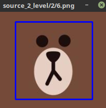

# object_position_label

- Based on [**Blog python-opencv-鼠标事件-画框圈定目标**](http://blog.csdn.net/lql0716/article/details/54174293).

## Statement
- Crop the object  in images by hand.
- Record the position(top left point and bottom right point) of this object.

## Details
Input an image into the function **get_position(image, title)**,  you can get a window of this image. 

- For the first time of clicking the left button of your mouse, you can pin the top left point of the box.
- For the second time of clicking the left button, you can pin the bottom right point of the box.
- For the third time of clicking the left button (which means make sure to crop), this function will return thest two points' location **(x1, y1), (x2, y2)**.
- Before make sure to crop the box, you can click right button of your mouse to cancle the pins of the box.

And what the demo does is that 

- invoke the function **get_position(image, title)**  to get two points' location.
- Crop the box, save the box to  **dst_dir** .
- Record these two points' location to **record_file**.
- Move the input image to **done_dir**.

## Environment
- **python3.5.2**
- **opencv3.2.0**

